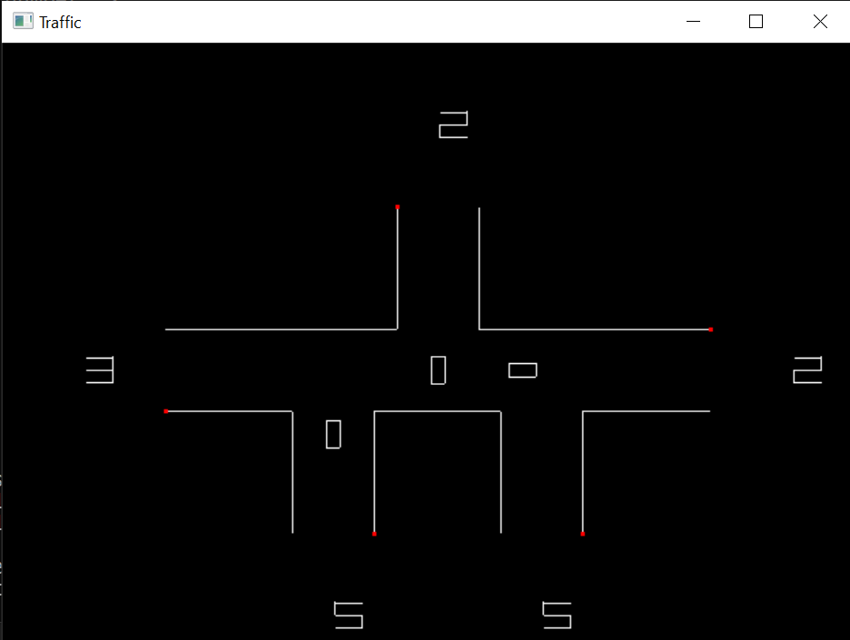

# Traffic Sim 🚦

Simulate traffic through a lighted junction, controlling arrival rates and how many cars each light lets through in turn.

# Usage
Built to run on windows

To use, run `./traffic.exe` (i.e. open cmd navigate tot he project directory and run `.\traffic.exe`) then enter the relevant inputs. You will be asked for:

<ul>
<li>"The number of entries" - The number of roads that are within this light controlled junction.</li>
<li>"The number of depature traffic" - The number of cars that leave from an exit within it turn.</li>
<li>"The number of arrival traffic" - The number of cars that arrive at an entrance within a 1000 frames of time.</li>
</ul>

Once inputted the simulation animations will start up.  
To modify how fast it runs change the sleep() found on  line 144 of traffic-animation/roads.c

## Compiling

You will need a 64-bit Windows C compiler and this library `libwinpthread-1.dll`.  

For Windows, in the project root directory run:  
`gcc.exe traffic.c traffic-animation/cars.c traffic-animation/constants.c traffic-animation/overflow.c traffic-animation/roads.c -o traffic.exe -lgdi32 -luser32`

# Differential equations

This is a seperate included C file/.exe which takes the rate of flows inputs and calculate hte best configuration for how many cars should leave from each light to keep the wait time most optimised.

This work with the following logic:

Intuitively, if `the rate of release is >= the rate of arrival` the problem is solved.

Firstly, we should add a penalty if a car is waiting a long time it is worse, i.e. 1 car waiting for 10 ticks is equivalent to 10 cars waiting for 1. This leads to the value at each entry point being the sum of the series multiplies by the rate, the total value of an entry point is this number take away the number of cars we release which is the rate $x_i$. This leads to these two equations, where $S$ is the sum of cars waiting x time we are minimising and the second equations it taking intoa ccount switching times between entries.

$$
S = \sum_{i=1}^{n} f_i = \sum_{i=1}^{n} ((r_i  - x_i) \circ \frac{T^2}{2} - T)
$$
$$
\sum_{i=1}^{n} x_i = T - n
$$

We are trying to minismise $S$, and by working out a scaling factor taking into account switching time we get release rate relative to entrance rate is. 

$$
x_i = \frac{r_i (T - 6n)}{\sum_{i=1}^{r_i}}
$$

## Future
<ul>
<li>Add the code for the  differential equations solver, the groundwork has been put in place.</li>
<li>Add a gif the of traffic.exe running</li>
</ul>
